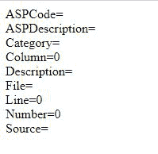

# ASP 错误对象属性

> 原文:[https://www . geesforgeks . org/ASP-as error-object-properties/](https://www.geeksforgeeks.org/asp-asperror-object-properties/)

*   **ASP Code:** The **ASPCode** is used for returning the string value which determines the error code that would be generated by the IIS server. This Property applies to Error Object. It is an inbuilt method of the Error object.

    **语法:**

    ```
    ASPError.ASPCode()
    ```

*   **ASPDescription:** The **ASPDescription** is used to return a detailed description of an error.

    **语法:**

    ```
    ASPError.ASPDescription()
    ```

*   **ASP Category:** The **ASP Category Property** is used to return the source of an error.

    **语法:**

    ```
    ASPError.Category()
    ```

*   **Column:** The **ASP Column property** is used to the column position within the ASP file that generated the error.

    **语法:**

    ```
    ASPError.Column()
    ```

*   **Description:** The **ASP Description property** is used to return a small description of an error.

    **语法:**

    ```
    ASPError.Description()
    ```

*   **文件:****ASP 文件属性**用于返回产生错误的 ASP 文件的名称。

    **语法:**

    ```
    ASPError.File()
    ```

*   **Line:** The **ASP Line Property** is used to return a line number in the ASP file which generates an error.

    **语法:**

    ```
    ASPError.Line()
    ```

*   **Number:** The **ASP Number Property** is used to return the standard COM error code for the error.

    **语法:**

    ```
    ASPError.Number()
    ```

*   **Source:** The **ASP Source Property** is used to return the actual source code of the line where the error occurred.

    **语法:**

    ```
    ASPError.Source() 
    ```

**示例代码:**下面的代码涵盖了错误对象的所有属性。

## 动态服务器页面

```
<%
dim objErr
set objErr=Server.GetLastError()

response.write("ASPCode=" & objErr.ASPCode)
response.write("<br>")
response.write("ASPDescription=" & objErr.ASPDescription)
response.write("<br>")
response.write("Category=" & objErr.Category)
response.write("<br>")
response.write("Column=" & objErr.Column)
response.write("<br>")
response.write("Description=" & objErr.Description)
response.write("<br>")
response.write("File=" & objErr.File)
response.write("<br>")
response.write("Line=" & objErr.Line)
response.write("<br>")
response.write("Number=" & objErr.Number)
response.write("<br>")
response.write("Source=" & objErr.Source)
%>
```

**输出:**

