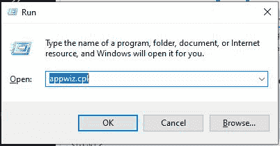
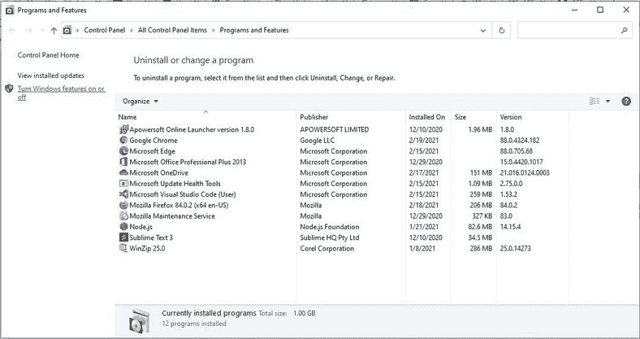
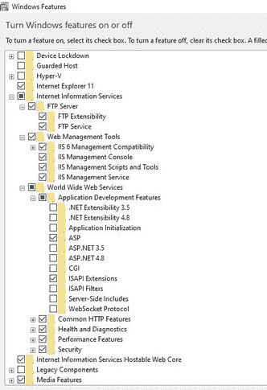
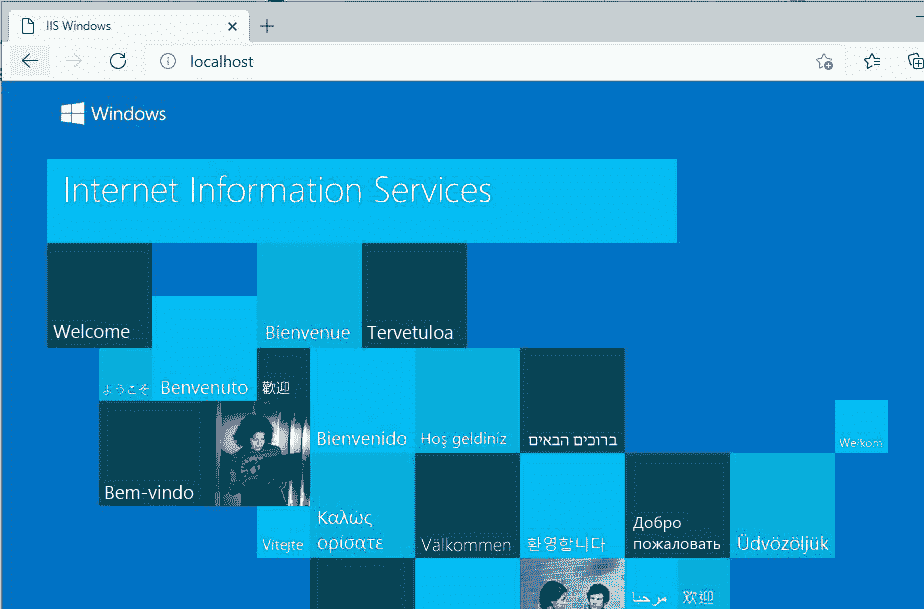

# ASP 介绍及安装

> 原文:[https://www . geesforgeks . org/ASP-introduction-and-installation/](https://www.geeksforgeeks.org/asp-introduction-and-installation/)

ASP 代表**活动服务器页面**。它通常被称为经典 ASP 或 ASP 经典。ASP 是一种服务器端脚本语言，用于在网络服务器上执行脚本。这项技术是由微软开发的。这是一个古老但仍然有用的工具，用于创建动态网页。

ASP 是一个运行在网络服务器内部的程序。活动服务器页面是一个编程环境，它使您能够在客户端和服务器端脚本的帮助下生成交互式动态 HTML 页面。

**ASP 文件包含什么:**

ASP 文件扩展名为**。asp"** 。它与超文本标记语言文件相同。除了 HTML 标记之外，ASP 文件还可以包含服务器脚本。在 ASP 页面中，VB Script 通常用作服务器端，而 JavaScript 用作客户端脚本语言。

**ASP 的用途:**

*   它用于在用户提交表单时从表单中获取或检索数据。例如，您可以让用户提交他们的电子邮件地址以添加到邮件列表中。
*   它用于编辑。更改并向网页添加更多内容，并创建自定义网站。
*   用于**从网页浏览器获取并设置 cookie**。
*   它用于对用户查询做出响应。
*   它用于与数据库通信，意味着读取存储在数据库中的数据或将新数据写入数据库。
*   它用于实现会话。基本上，会话是一种存储用户访问网站期间发生的信息的方式。通过这种机制，您将能够存储关于用户的信息，比如他们在什么时候访问了一个页面。

**它是如何工作的？**

*   *当网络浏览器向网络服务器请求*一个*超文本标记语言文件*时，它将返回网络浏览器的文件。
*   另一方面。当客户端请求 ASP 文件时，服务器将请求传递给 ASP 引擎。
*   ASP 引擎用于读取 ASP 文件内容和执行服务器脚本。
*   最后。文件以纯文本形式返回浏览器。

**如何运行 ASP 文件？**

1.  Firstly download and install a setup on your computer.
    *   按下窗口+ R 键，在运行框中输入**appwiz . CPL****，然后按回车键。**

    ****

    *   **选择 **【打开或关闭窗口功能】****

    ****

    *   **现在点击**互联网信息服务**复选框，选择子组件如下图。单击“确定”后需要一段时间。**

    ****

    *   **进入浏览器导航至本地主机。**

    ****

2.  **安装后，在电脑硬盘上搜索名为“**Inetpub”**的新文件夹。**
3.  **在“**InetPub”**文件夹中，打开一个名为“ ***wwwroot”的新文件夹。***

    ```vb
    C:\inetpub\wwwroot
    ```** 
4.  **在 **wwwroot 中创建一个名为“极客”的新文件夹。****
5.  **在**极客**文件夹内新建一个名为**【gfg . ASP】**的文件。**
6.  **写一些 ASP 代码，将文件保存为“GFG.asp”。**
7.  **现在，检查你的网络服务器是否正常运行。**
8.  **最后，打开浏览器，输入**“http://localhost/Geeks/gfg . ASP”**，即可查看自己的第一个网页**

****示例:**ASP 中一个简单的 Hello world 程序。**

## **动态服务器页面**

```vb
<!DOCTYPE html>
<html>
<body>

<%
response.write("Hello World")
%>

</body>
</html>
```

****输出:****

```vb
***Hello World*** 
```

*****解释:*** 这是经典 ASP 页面的一个非常基本的例子，它将短语“Hello World”与标准 HTML 的其余部分一起返回给浏览器。HTML 部分是静态的，即服务器将按原样将它们发送给浏览器。由< % % >分隔的部分是服务器在发送给客户端之前实际要处理的内容。**